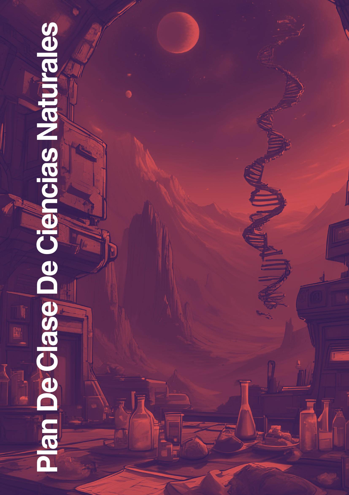

::: {.content-visible when-format="html"}
::: {.text-center .my-4}
{fig-alt="Portada del libro Natura Docens" width="60%" style="max-width: 480px; border-radius: 8px; box-shadow: 0 4px 16px rgba(0,0,0,0.12);"}
:::
:::

**Guía didáctica y curricular para educación básica secundaria y media con enfoque pedagógico inclusivo.**

Este libro reúne planes de clase estructurados con fundamentación teórica, ideas previas, contextualización analógica, ejercicios por niveles, retos, aplicación y componente socioemocional para el área de Ciencias Naturales (Biología, Física y Química).

## Créditos y Gestión del Proyecto

::: {.grid}
::: {.g-col-12 .g-col-md-6}
### Autoría y Dirección General
**Camilo Tayac**  
*Creador, Ejecutor del Proyecto y Analizador Pedagógico-Curricular*  
Colección: *Biblioteca de Camilo Tayac de Ciencias Naturales*
:::

::: {.g-col-12 .g-col-md-6}
### Enfoque y Modelo Pedagógico
Articulación de los Lineamientos Curriculares y Derechos Básicos de Aprendizaje (DBA) del MEN con:
- **DUA:** Diseño Universal para el Aprendizaje y estrategias diferenciadas.
- **Escuela Activa:** Centralidad del estudiante y aprendizaje experiencial.
- **Método Richard Feynman:** Contextualización mediante analogías cotidianas sostenidas.
- **Pruebas de Estado:** Preparación estructurada para evaluaciones Saber 11° (ICFES).
:::
:::

## Acompañamiento Institucional y Comunidad Educativa

Este texto curricular se implementa y retroalimenta de forma continua en instituciones educativas. A continuación se registra el historial de colegios, directivos y comités docentes que han participado en la revisión pedagógica y validación en aula a lo largo de las distintas vigencias:

| Vigencia / Periodo | Institución Educativa | Directivas y Rectoría | Docentes Colaboradores |
|:---|:---|:---|:---|
| **2025 - 2026** | **Institución Educativa Mariscal Sucre** | Rectoría Institucional<br>*Coordinación Académica* | Comité Docente de Ciencias Naturales<br>(Biología, Física y Química) |

## Estructura Didáctica de las Unidades

Cada unidad temática del libro está organizada en nueve componentes consistentes:

1. **Teoría:** Fundamentación conceptual respaldada por textos de referencia disciplinar y artículos de investigación.
2. **Ideas previas:** Narrativas y preguntas orientadoras para activar los conocimientos previos del estudiante.
3. **Contextualización:** Explicación del concepto mediante el método Richard Feynman con analogías sostenidas.
4. **Contextualización para caracterizados:** Estrategias pedagógicas diferenciadas (discapacidad cognitiva, TDAH, TEA, accesibilidad visual y motora).
5. **Ejemplos resueltos:** Ejercicios modelo modelados paso a paso en tres niveles (Básico, Intermedio y Avanzado).
6. **Ejercicios:** Práctica guiada e individual para consolidar competencias de indagación y explicación de fenómenos.
7. **Retos:** Problemas desafiantes de profundización y aplicación en escenarios complejos.
8. **Aplicación:** Conexión con el entorno cotidiano, problemas ambientales y experiencias prácticas de laboratorio.
9. **Socioemocional:** Reflexión guiada y acompañamiento emocional vinculado a la perseverancia en el aprendizaje científico.

## Orientaciones Pedagógicas y Prefacio

Este libro de Ciencias Naturales está diseñado para acompañar el proceso de aprendizaje desde grado sexto hasta grado undécimo, integrando Biología, Física y Química en una ruta curricular progresiva. El material prioriza la comprensión conceptual profunda, el razonamiento científico riguroso y la transferencia práctica de conocimientos a situaciones cotidianas y evaluaciones estandarizadas.

La organización temática va de lo general a lo específico: cada lección inicia con la exploración de intuiciones y preconceptos, avanza hacia la formalización matemática y conceptual con rigor universitario, y culmina en la aplicación y resolución guiada de problemas tipo Saber 11°.

## Marco Legal y Licencia

© 2025–2026 Camilo Tayac. Todos los derechos del modelo pedagógico y análisis curricular reservados.

Esta obra se distribuye bajo una **Licencia Creative Commons Atribución-NoComercial 4.0 Internacional (CC BY-NC 4.0)**. Se autoriza libremente su lectura, descarga, copia, distribución digital e impresión con fines pedagógicos e institucionales sin ánimo de lucro comercial.

::: {.content-visible when-format="typst"}
```{=typst}
#pagebreak()
#align(center)[
  #v(1em)
  #text(size: 22pt, weight: "bold", fill: rgb("#a06050"))[
    Tabla de contenidos
  ]
  #v(0.5em)
  #rect(width: 60pt, height: 2pt, fill: rgb("#a06050"))
  #v(1.5em)
]
#outline(
  title: none,
  depth: 2,
  indent: 1.5em,
)
#pagebreak()
```
:::
